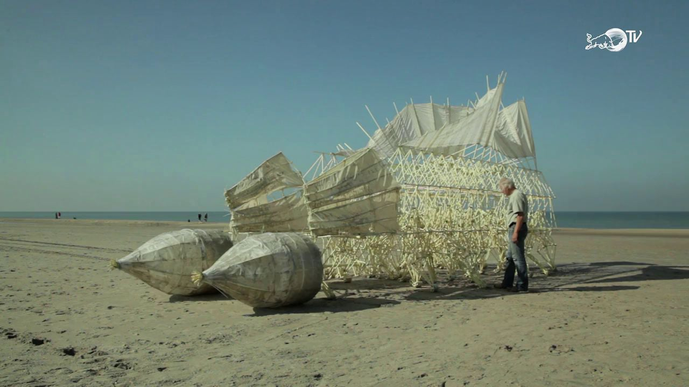
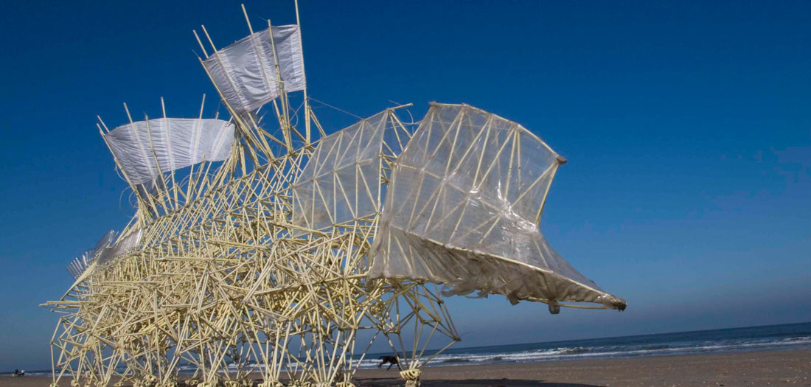
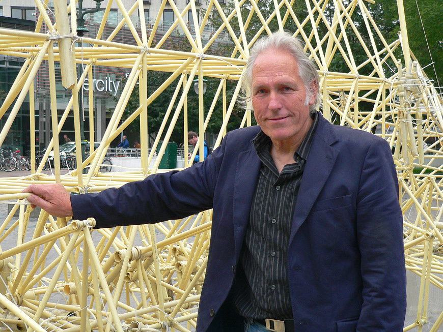
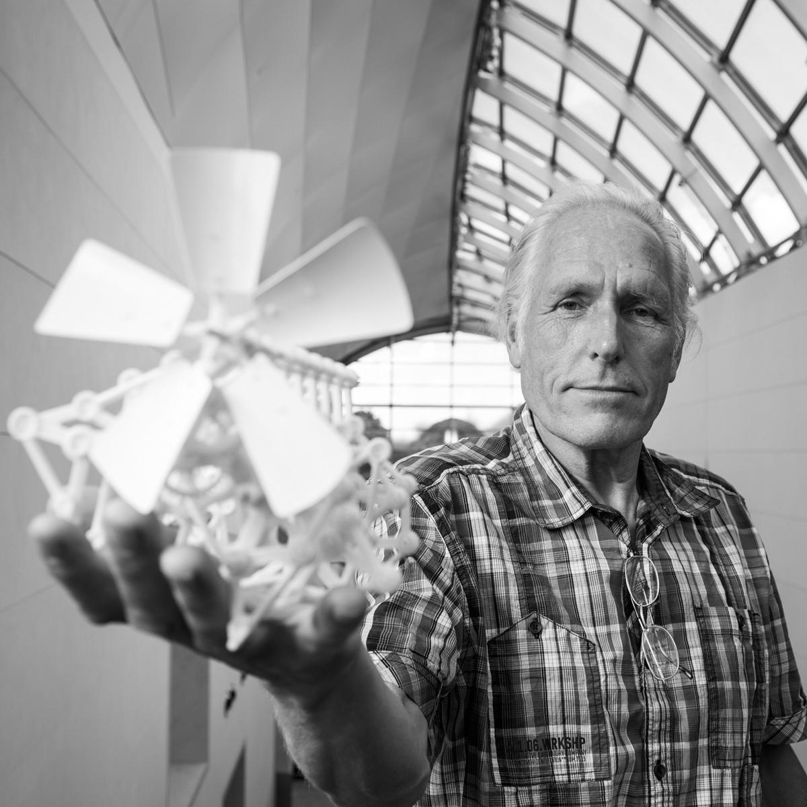
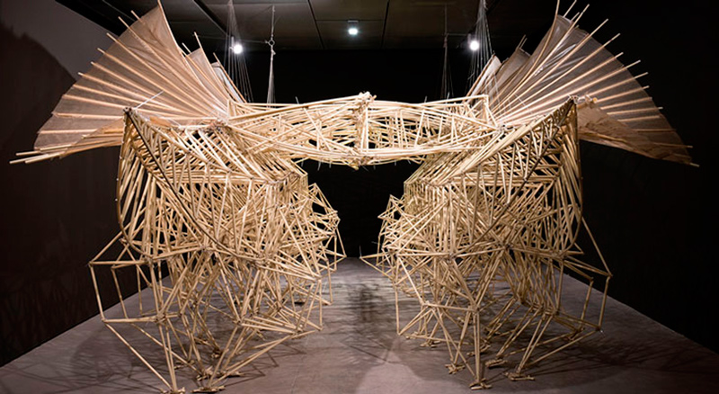
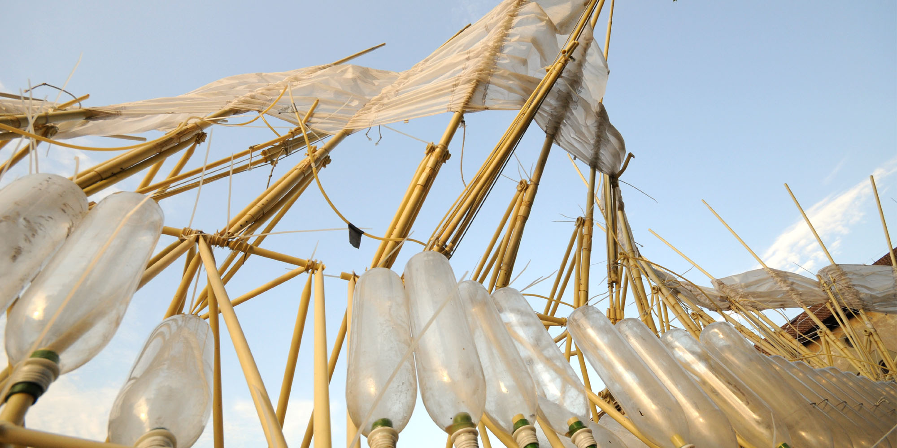
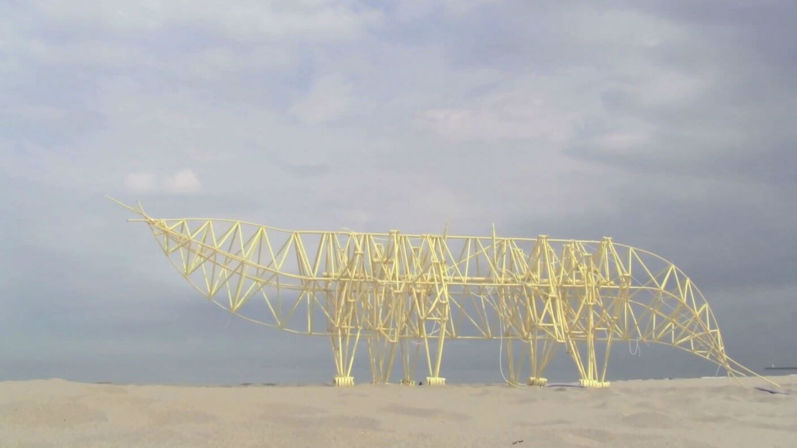
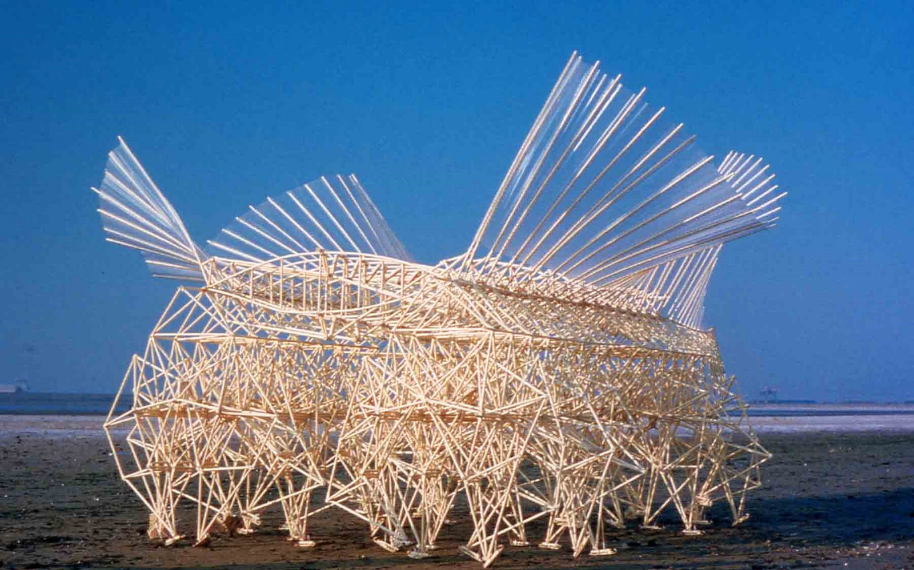
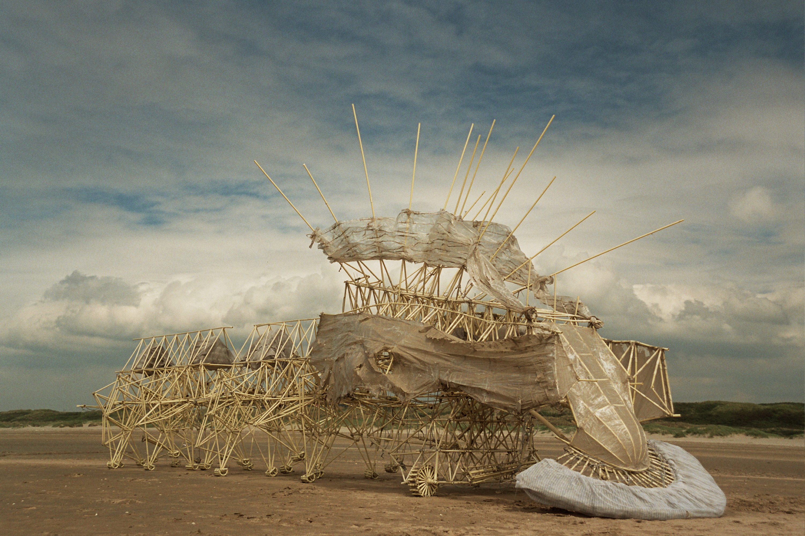
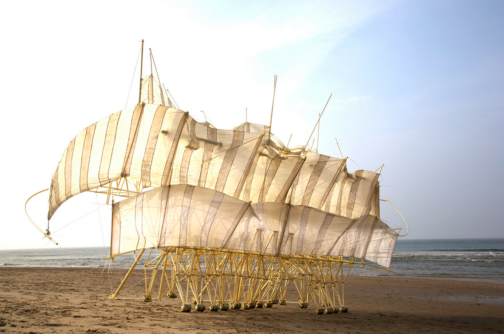

# Theo-Jansen

[video](#video) | [docu](#docu) | [posts](#posts) | [photos](#photos)

> Theodorus Gerardus Jozef "Theo" Jansen is a Dutch artist. In 1990, he began building large mechanisms out of PVC that are able to move on their own and, collectively, are entitled, Strandbeest. The kinetic sculptures appear to walk.

Wikipedia

- <http://www.strandbeest.com/>
- <https://en.wikipedia.org/wiki/Theo_Jansen>
- <https://www.facebook.com/Theo-Jansen-39899392820/>

## Video

<!--
<https://www.youtube.com/watch?v=2r9PXPDAm24>
-->

## Documentaire

In dutch (might be impossible to see outside the Netherlands):

Het uur van de Wolf:

<https://www.npo.nl/het-uur-van-de-wolf/14-01-2016/VPWON_1224493>

Kunstuur:

<https://npo.nl/kunstuur/17-12-2017/AT_2084764>

**Tip: install "Hola"-plugin**

## Posts

<https://imgur.com/gallery/wZE69>

english:

- TED: <https://www.ted.com/talks/theo_jansen_creates_new_creatures>
- <http://historiesofthingstocome.blogspot.nl/2018/01/wonders-of-millennial-world-9-new-years.html>

dutch:

<https://www.onlinegalerij.nl/theo-jansen-kunstenaar-van-het-jaar-2018/>

## TWitter account

??

<https://twitter.com/StrandBeests>

## Photos

